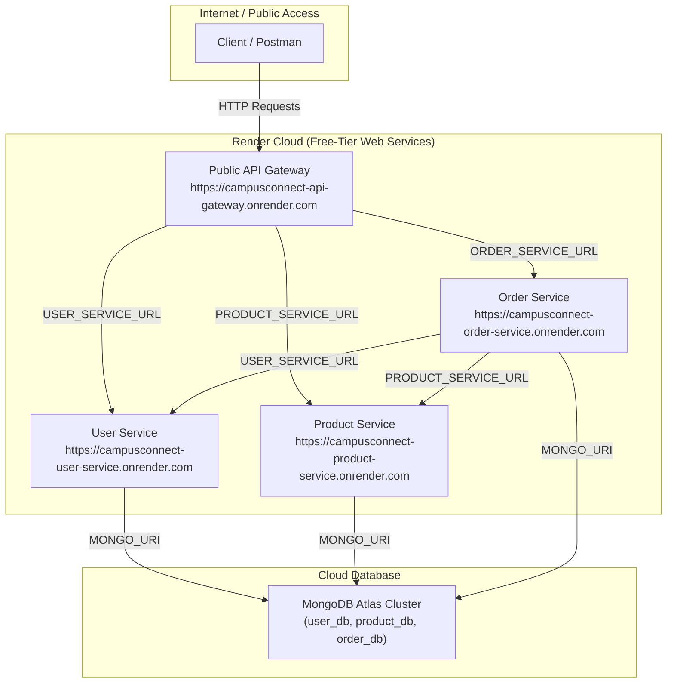

# CampusConnect — Lab 7 Architecture Diagrams

## 1. Target Production Architecture (Isolated Private Services)

The diagram below reflects the primary microservices architecture featuring the **API Gateway** as the single public entry point, configuration-based service discovery, isolated container networking (`campus-network`), and MongoDB Atlas persistence.

---

## 2. Cloud Free-Tier Fallback Architecture (Render Web Services)

Because Render does not offer Private Services (`pserv`) on its free plan tier, the cloud deployment adapts by running backend services as **Render Web Services** while maintaining configuration-based discovery and environment variable routing.

### Architecture Summary

1. **Target Local Architecture**:
   * **API Gateway**: Exposed on host port `3000:3000`.
   * Microservices isolated inside `campus-network` without host port exposure.
2. **Cloud Free-Tier Fallback**:
   * All 4 services deployed as **Render Web Services** (`type: web`).
   * Service locations dynamically linked using Render environment variables (`fromService: host`).
   * No hardcoded URLs in source code.
