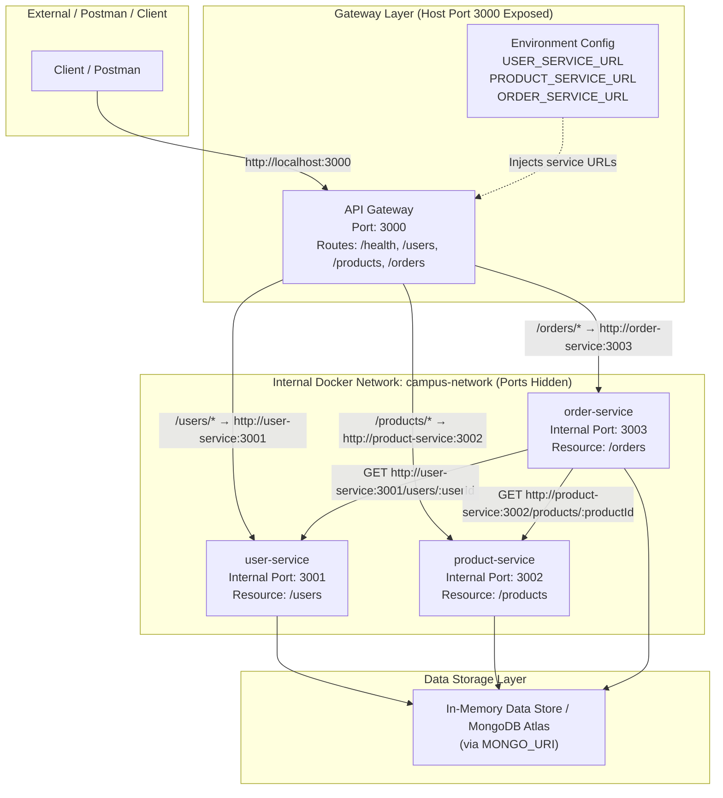

# CampusConnect — Lab 7 Architecture Diagram (API Gateway & Microservices)

The diagram below reflects the Lab 7 microservices architecture featuring the **API Gateway** as the single public entry point, configuration-based service discovery, isolated container networking, and optional MongoDB Atlas persistence.

### Architecture Summary

1. **Single Entry Point**:
   * **API Gateway**: Exposed on host port `3000:3000`.
   * Backend microservices (`user-service`, `product-service`, `order-service`) have NO host port mappings and are completely hidden from external access.

2. **Configuration-Based Service Discovery**:
   * Target locations are specified via environment variables (`USER_SERVICE_URL`, `PRODUCT_SERVICE_URL`, `ORDER_SERVICE_URL`).
   * Service locations can be changed dynamically in configuration without modifying gateway code.

3. **Internal Container-to-Container Communication**:
   * Order service continues to communicate directly with User and Product services using Docker DNS (`http://user-service:3001`, `http://product-service:3002`).

4. **Data Persistence**:
   * Microservices operate in in-memory mode by default, or seamlessly connect to MongoDB Atlas when `MONGO_URI` is provided.
